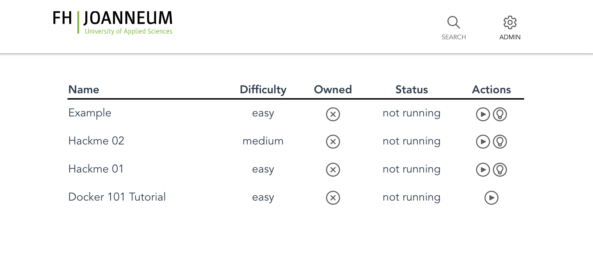
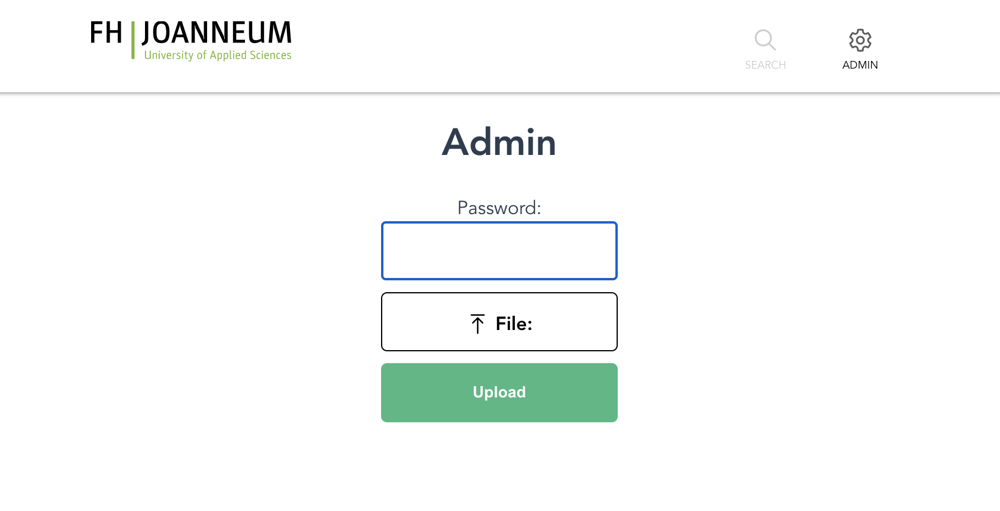
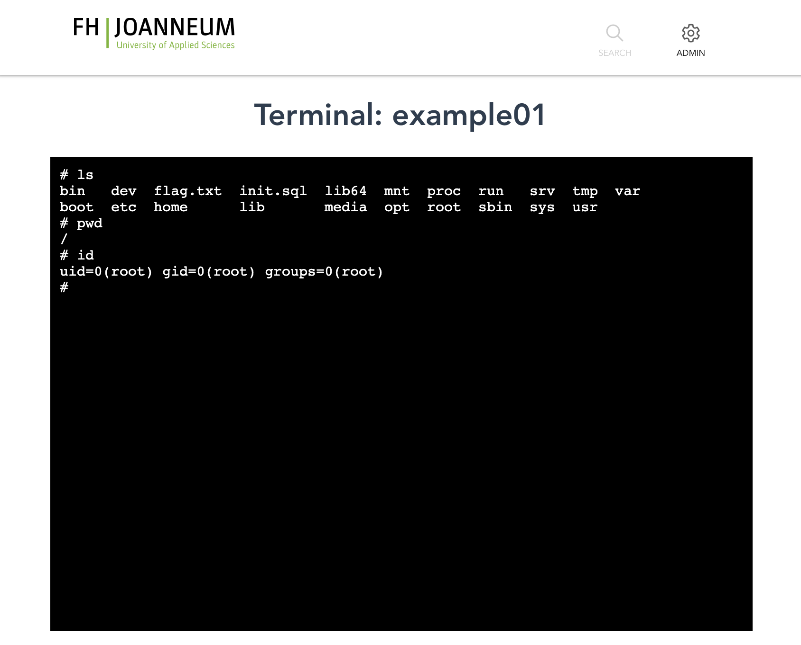
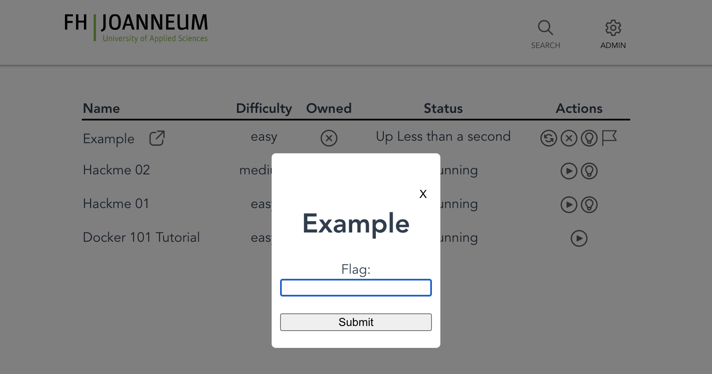
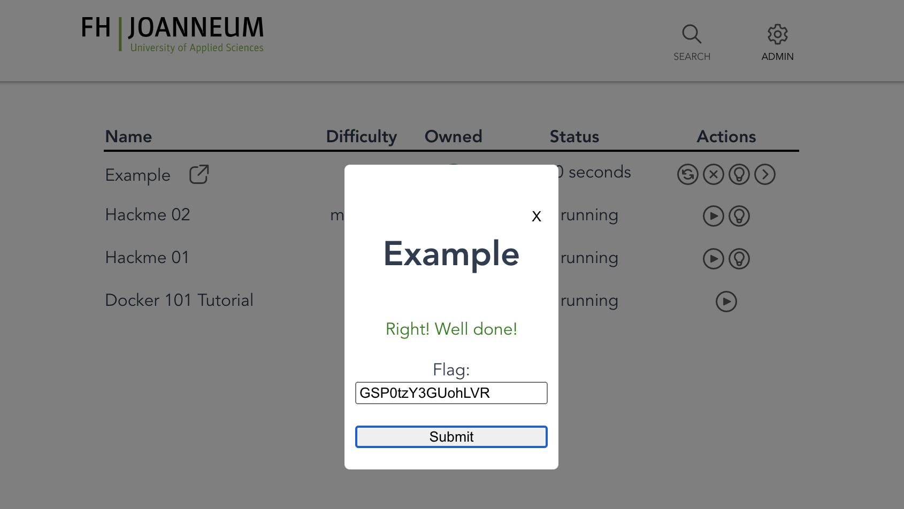

# AWE-Frontend

This is the frontend for the AWE Learning platform. https://github.com/heliistanders/awe




## Project setup
Install dependencies (required!)
```
npm install
```

### Compiles and hot-reloads for development
```
npm run serve
```

### Compiles and minifies for production
```
npm run build
```
After building, copy the dist folder as `public` to the same directory as the awe executable and start the executable.

## Pages

### Main Page
The Main page displays every installed challange on the host.


### Admin Page
The admin page allows to upload additional challenges without connecting to the host.


### Terminal Page
The Terminal page allows the user to get an interactive terminal in every solved & running challenge to take a look at the vulnerability.


### Flag Submit
To solve a challenge find the /flag.txt file and submit it, via the flag icon to mark the challenge as solved and gain terminal access.




# License

This project uses the Fluent Icon Pack from Microsoft which can be found here:
https://github.com/microsoft/fluentui-system-icons
